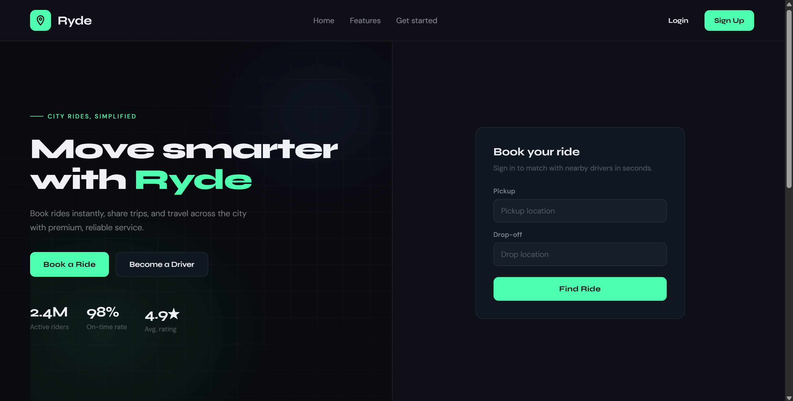
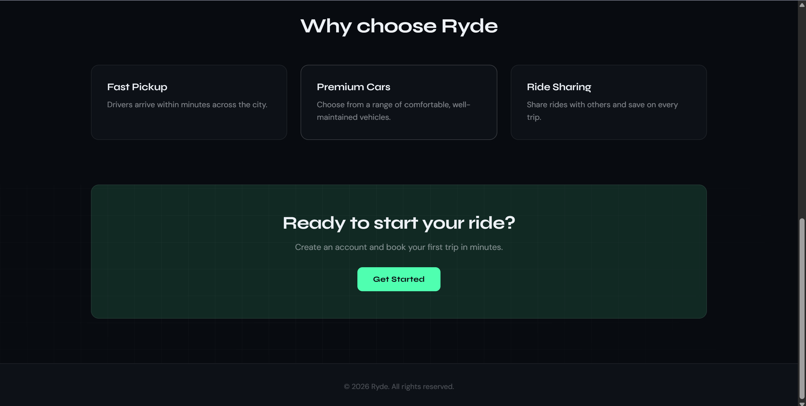
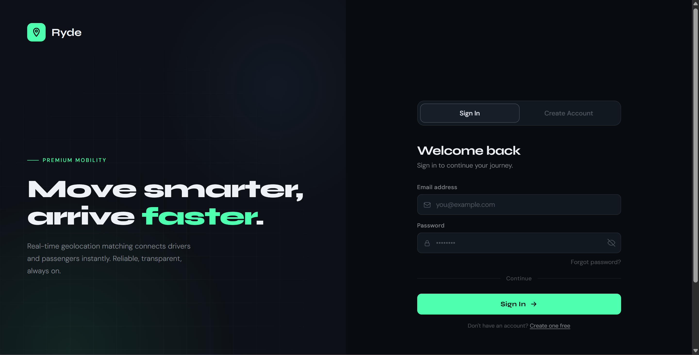
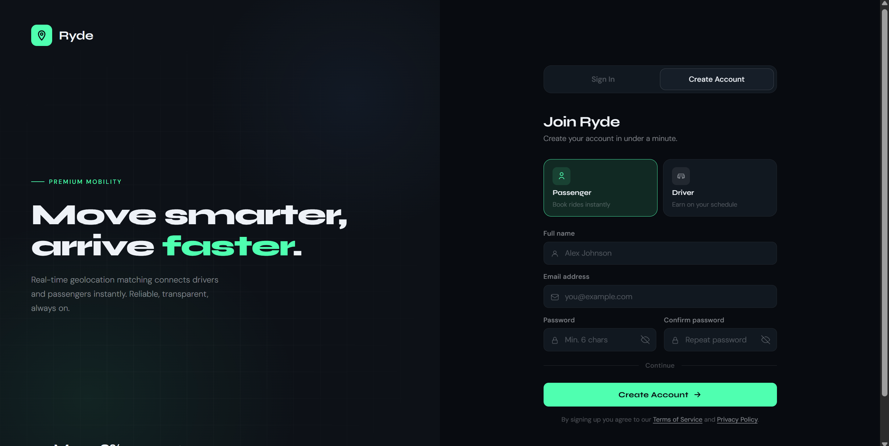
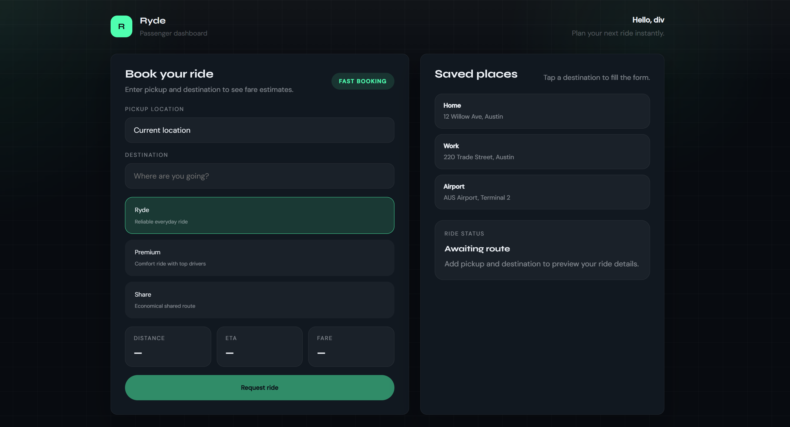

# Ryde Frontend

Web client for **Ryde** — landing page, authentication, and passenger ride booking. Built with React and Vite; connects to the [Ryde Backend](https://github.com/divyuuu/ryde-backend) API.

## Preview



## Tech stack

| | |
|---|---|
| UI | React 19, TypeScript |
| Build | Vite 8 |
| Routing | React Router 7 |
| HTTP | Axios |
| Maps (planned) | Leaflet, react-leaflet |
| Feedback | react-toastify |

## Features

- **Landing page** — hero, features, call-to-action, footer
- **Auth** — login and signup with validation; driver or passenger role on signup
- **Passenger dashboard** — pickup/destination, ride tiers, saved places; profile from API

> **Status:** Auth and dashboard UI talk to the backend. Map integration and live ride booking API calls are planned.

## Prerequisites

- **Node.js** 20+ (LTS recommended)
- **npm**
- **[ryde-backend](https://github.com/divyuuu/ryde-backend)** running at `http://localhost:8080` (see that repo’s README for PostgreSQL and env vars)

## Run locally

```bash
git clone https://github.com/divyuuu/ryde-frontend.git
cd ryde-frontend
npm install
npm run dev
```

Open **http://localhost:5173**

| Script | Command | Purpose |
|--------|---------|---------|
| Dev server | `npm run dev` | Hot reload development |
| Production build | `npm run build` | Typecheck + bundle to `dist/` |
| Preview build | `npm run preview` | Serve production build locally |
| Lint | `npm run lint` | ESLint |

**Order:** start the backend first, then run `npm run dev` here.

## Configuration

The API client uses the backend URL by default:

```ts
// src/api/api.ts
baseURL: "http://localhost:8080/api"
```

JWT is stored in `localStorage` as `token` and sent as `Authorization: Bearer …` on each request.

For a custom API URL, add `.env` (do not commit secrets):

```env
VITE_API_BASE_URL=http://localhost:8080/api
```

## Routes

| Path | Page |
|------|------|
| `/` | Landing |
| `/auth?tab=login` | Login |
| `/auth?tab=signup` | Sign up |
| `/dashboard/:uuid` | Passenger dashboard (after login) |

## Screenshots

| Landing (hero) | Landing (features) |
|----------------|-------------------|
|  |  |

| Sign in | Create account |
|---------|----------------|
|  |  |

| Passenger dashboard |
|---------------------|
|  |

## Project structure

```
ryde-frontend/
├── docs/screenshots/              # README screenshots
├── public/
├── src/
│   ├── api/
│   ├── components/
│   ├── pages/
│   ├── styles/
│   ├── types/
│   ├── Router.tsx
│   └── main.tsx
├── package.json
└── README.md
```

## Related repository

| Repo | Link |
|------|------|
| **ryde-frontend** (this repo) | https://github.com/divyuuu/ryde-frontend |
| **ryde-backend** | https://github.com/divyuuu/ryde-backend |

## License

All rights owned by @divyuuu
